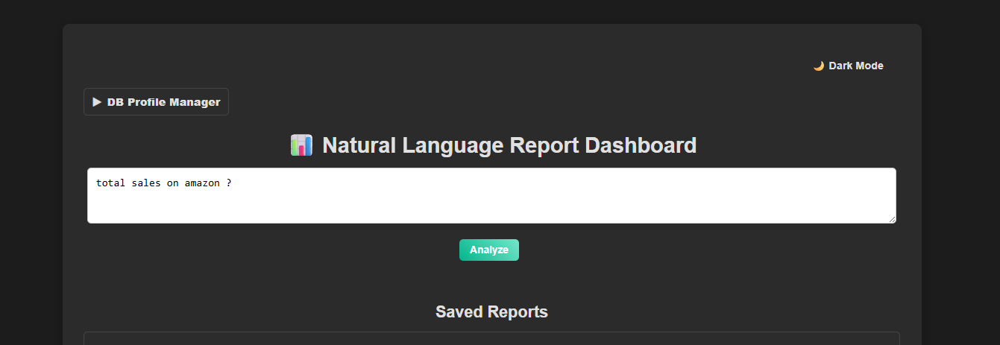
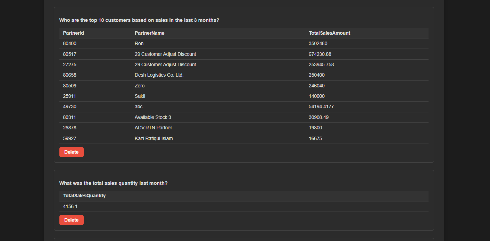
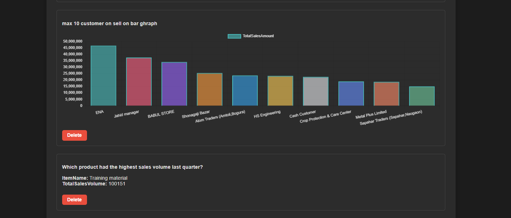
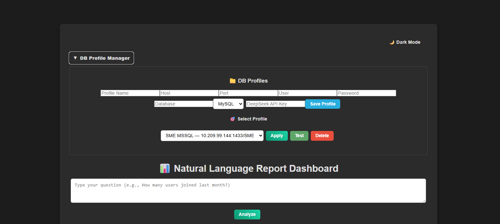

# NL Report Dashboard
The NL Report Dashboard is a full-stack application with a React frontend and Python FastAPI backend, designed to connect to a database and retrieve data using natural language queries powered by a Large Language Model (LLM). Users can select database profiles, input queries, and visualize results as tables or charts (bar, line, pie).
Database profile selection interface showing input fields for Profile Name, Host, Port, User, Password, Database, Engine (MySQL/MSSQL), and DeepSeek API Key, with a "Select Profile" dropdown and buttons to Apply, Test, or Delete profiles.




## ✨ Features

- Natural Language Queries: Use plain English to query databases (e.g., "How many users joined last month?").
- LLM-Powered SQL Generation: Automatically generates SQL queries using an LLM via a Colab API.
- Database Support: Connects to MySQL or MSSQL databases with configurable profiles.
- Data Visualization: Displays results as tables or charts (bar, line, pie) using Chart.js.
- Report Management: Save, view, and delete reports with query results and visualizations.
- Dynamic DB Profiles: Manage multiple database connections with a user-friendly interface.


## 🔧 Prerequisites
Ensure you have the following installed:

- Python 3.11 or higher
- Node.js (v16 or higher) and npm
- Git
- Code editor (e.g., VS Code)
- A database (MySQL or MSSQL)
- Access to a Colab API (e.g., via ngrok) for LLM-based SQL generation
- DeepSeek API key for enhanced LLM functionality


## 🚀 Setup Instructions
1. Clone the Repository
```console
git clone https://github.com/0smanGoni/NL-Report-Dashboard.git
cd nl-report-dashboard
```

2. Backend Setup
a. Create a Virtual Environment
```console
cd backend
python3 -m venv myenv
```
Activate the environment:

Linux/macOS:
```console
source myenv/bin/activate
```
Windows:
```console
myenv\Scripts\activate.bat
```
b. Install Dependencies
```console
pip install -r requirements.txt
```
The backend will run on http://localhost:8000.
3. Frontend Setup
a. Create and Initialize the React Project
If the frontend directory doesn’t exist, create it with Vite:
npm create vite@latest frontend -- --template react
```console
cd frontend
```
b. Install Dependencies
```console
npm install
npm install axios react-chartjs-2 chart.js
```
c. Run the Frontend
Start the React development server:
```console
npm run dev
```
The frontend will run on http://localhost:5173 (or another port if specified by Vite).

## 🔑 Configuration
- Backend

  - Database Profiles: Use the /profiles endpoint to save database configurations (host, port, user, password, database name, engine).
  - Colab API: Update the COLAB_API_URL in openai_utils.py with your ngrok URL for LLM queries.
  - Database Engine: Supports MySQL (mysql) and MSSQL (mssql). Set the ENGINE in the database profile.

- Frontend

  - API Base URL: Ensure frontend/src/api/reportApi.js points to http://localhost:8000 for backend communication.
  - Chart.js: Configured in ChartRenderer.jsx for bar, line, and pie charts. Customize colors and styles in the component if needed.


🏃 Using the Application

- Select a Database Profile:

  - Navigate to the DB Profiles section.
  - Add a new profile or select an existing one and click "Apply".
  - Test the connection using the "Test" button.
  


- Enter a Query:

  - Use the query box to input a natural language question (e.g., "total sales on amazon ?").
  - Click "Analyze" to generate and execute the SQL query.


- View Results:

  - Results display as a table, chart, or single value based on the query and data.
  - Save reports for later use or delete them from the Saved Reports section.


- Visualize Data:

  - Charts are rendered for queries with two columns and multiple rows (e.g., bar chart for sales data).
  - Tables are used for complex or non-chartable data.


## 🛠️ Troubleshooting

- Backend Errors:

  - API Connection: Ensure the COLAB_API_URL is correct and the ngrok server is running.
  - Database Connection: Verify DB credentials in the profile and test using /test-db-connection.
  - Dependencies: Re-run pip install -r backend/requirements.txt if issues occur.


- Frontend Errors:

  - CORS Issues: Confirm the backend allows CORS (* origins in main.py).
  - API Errors: Check that the backend is running on http://localhost:8000.
  - Dependencies: Re-run npm install in the frontend directory.


- Chart Rendering:

  - Ensure data has at least two columns and multiple rows for charts.
  - Check ChartRenderer.jsx for supported chart types (bar, line, pie).


Logs: Review backend console output or browser developer tools for errors.


## 🤝 Contributing
Contributions are welcome! To contribute:

Fork the repository.

- Create a feature branch:
```console
git checkout -b feature/your-feature
```

- Commit changes:
```console
git commit -m "Add your feature"
```

- Push to the branch:
```console
git push origin feature/your-feature
```

- Open a pull request.


Please follow the Code of Conduct (if available).

## 📜 License
This project is licensed under the MIT License. See the LICENSE file for details.

⭐ Star this repo if you find it useful!📩 For questions, open an issue or contact the maintainers.
